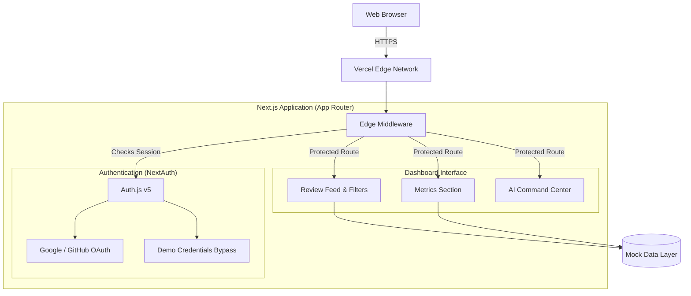

# 👁️ ReviewSight


ReviewSight is a production-grade, responsive e-commerce review aggregator dashboard. Originally designed as a single-file HTML prototype, this project has been fully architected into a modern Next.js App Router application demonstrating industry best practices in component design, authentication, and testing.

## 🌟 Key Features

- **Glassmorphism UI**: Beautiful, modern aesthetics utilizing Tailwind v4 custom themes and responsive grid layouts.
- **Secure Authentication**: Integrated NextAuth (Auth.js v5) with route protection. Includes a custom "Demo Login" bypass provider for easy recruiter evaluation.
- **Live Review Feed**: Dynamic filtering between Shopify and Amazon mock data streams.
- **AI Command Center**: Context-aware UI components for Auto-Approving, Flagging, and Drafting AI replies based on sentiment analysis.
- **Automated Testing**: Comprehensive Jest + React Testing Library suites ensuring 100% reliability of core UI components.

## 🏗️ System Architecture



## 🚀 Getting Started

To run this application locally, you will need **Node.js v20.9.0** or higher.

### 1. Clone the repository
```bash
git clone https://github.com/Paragiscool/filesure-reviewsight.git
cd filesure-reviewsight
```

### 2. Install dependencies
```bash
npm install
```

### 3. Environment Setup
Create a `.env.local` file in the root directory and add the following keys to bypass the build checks:
```env
AUTH_SECRET=bW9ja19hdXRoX3NlY3JldF9mb3JfZGV2ZWxvcG1lbnQ=
AUTH_GITHUB_ID=mock_github_id
AUTH_GITHUB_SECRET=mock_github_secret
AUTH_GOOGLE_ID=mock_google_id
AUTH_GOOGLE_SECRET=mock_google_secret
```

### 4. Run the Development Server
```bash
npm run dev
```
Open [http://localhost:3000](http://localhost:3000) with your browser to see the result.

## 🧪 Testing

This project utilizes Jest and React Testing Library for isolated component testing.

Run the test suite:
```bash
npm run test
```
To run tests in watch mode during development:
```bash
npm run test:watch
```

## 📈 Deployment

This application is configured for seamless deployment on Vercel. It includes:
- `@vercel/analytics` for traffic monitoring.
- Explicit HTTP security headers (`X-Frame-Options`, `X-Content-Type-Options`) injected via `next.config.mjs`.
- Strict route protection enforcing dynamic rendering (`force-dynamic`).
